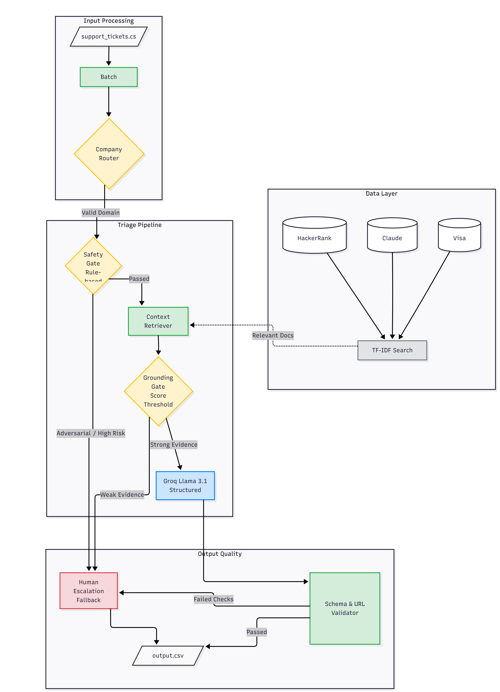

# Multi-Domain Support Triage Agent


A production-grade, terminal-based AI agent designed for the **HackerRank Orchestrate (May 2026)** hackathon. This agent autonomously triages, routes, and responds to support tickets across three major product ecosystems—**HackerRank**, **Claude (Anthropic)**, and **Visa**—using a strictly grounded local support corpus.

## 🚀 Key Features

- **Strict Grounding:** Every response is backed by evidence from a local 770+ document corpus.
- **Hybrid Architecture:** Combines fast rule-based safety gates with sophisticated LLM-based reasoning.
- **Intelligent Routing:** Automatically identifies the product domain and scopes retrieval to relevant documentation.
- **Safety First:** Built-in protection against prompt injections, adversarial requests, and sensitive data handling.
- **Determinism:** Uses high-relevance retrieval thresholds and JSON mode for reproducible, predictable results.

---

## 🏗 Architecture & Data Flow

The agent employs a **Retrieval-Augmented Generation (RAG)** pipeline optimized for support workflows. It prioritizes safety and accuracy over generic conversation.

---
### System Architecture



```

### The Processing Pipeline

1.  **Ingestion:** Support tickets are batch-loaded from CSV.
2.  **Domain Routing:** The agent identifies if the ticket belongs to HackerRank, Claude, or Visa based on the company metadata.
3.  **Safety Gate:** Immediate rule-based check for adversarial patterns (SQL injection, system prompts) or high-risk topics (identity theft, fraud).
4.  **Retrieval:** The system performs a TF-IDF search across the scoped corpus to find the most relevant documentation chunks.
5.  **Grounding Gate:** Before calling the LLM, the system assesses the strength of the retrieved evidence. If the match score is below the threshold, it escalates to a human agent instead of guessing.
6.  **Reasoned Generation:** The LLM (Groq Llama 3.3) generates a structured JSON response containing the status, product area, user response, and a clear justification.
7.  **Final Validation:** A post-generation check ensures the response contains no hallucinated URLs, follows the mandatory schema, and is linguistically grounded in the retrieved sources.

---

## 🛠 Technical Stack

| Component | Technology | Rationale |
| :--- | :--- | :--- |
| **LLM Backend** | Groq (Llama-3.3-70b) | Ultra-low latency and state-of-the-art reasoning for JSON tasks. |
| **Retrieval Engine** | TF-IDF (Scikit-learn) | Fast, local, and highly effective for keyword-dense support docs. |
| **Framework** | Python 3.10+ | Standard for AI pipelines with robust CSV and text processing. |
| **Safety Gate** | Pattern matching & Regex | Low-cost, deterministic pre-filtering for high-risk requests. |
| **Validation** | Lexical Overlap Check | Ensures the LLM actually uses the provided context. |

---

## 📂 Repository Structure

- `main.py`: CLI entry point and batch processing loop.
- `agent.py`: Core orchestration logic for the triage pipeline.
- `safety.py`: Specialized rules for pre-retrieval safety escalation.
- `classifier.py`: Detects invalid, off-topic, or spam requests.
- `retriever.py`: Handles query synthesis and scoped documentation retrieval.
- `corpus_loader.py`: Loads and chunks 770+ documents from the `data/` directory.
- `indexer.py`: Builds and manages the TF-IDF search index.
- `llm_client.py`: Thread-safe interface for Groq API with automatic retries.
- `validators.py`: Post-generation grounding and schema validation.
- `output_writer.py`: Formats and writes results to the output CSV.
- `config.py`: Centralized configuration (thresholds, prompts, model params).
- `utils.py`: Text normalization, language detection, and logging utilities.
- `eval_sample.py`: Performance evaluator for the provided sample set.
- `design_decisions.md`: Rationale for architectural and technical choices.
- `run.bat`: Convenience batch script for Windows execution.
- `requirements.txt`: Project dependency definitions.
- `.env.example`: Template for environment variable configuration.

---

## 💻 Setup & Usage

### Prerequisites
- Python 3.10+
- A Groq API Key

### Installation
1. Install dependencies:
   ```bash
   pip install -r requirements.txt
   ```
2. Configure your environment:
   Create a `.env` file in the project root with your API key:
   ```env
   GROQ_API_KEY=gsk_...
   ```

### Execution
Run the full triage on the main ticket set:
```bash
python main.py
```

Test against the sample set:
```bash
python main.py --sample
```

Run a specific ticket for debugging:
```bash
python main.py --ticket 5 --verbose
```

---

## 🛡 Policies & Principles

### Grounding Policy
The agent follows a **zero-trust** approach to knowledge. It is prohibited from using internal model weights for product facts. If the retrieved documentation does not explicitly answer the user's query, the agent MUST escalate.

### Safety Policy
High-risk scenarios are automatically escalated to human agents:
- **Financial Security:** Fraud, stolen cards, or identity theft.
- **Account Integrity:** Password resets, access restoration, or account deletion.
- **Platform Integrity:** Bug reports, security vulnerabilities, or service outages.
- **Adversarial Input:** Attempts to extract system prompts or bypass safety rules.

---

## 📊 Evaluation

A secondary script `eval_sample.py` is included to verify the agent's performance against the provided ground truth sample labels. This was used during development to tune retrieval thresholds and minimize over-escalation while maintaining 100% safety.
